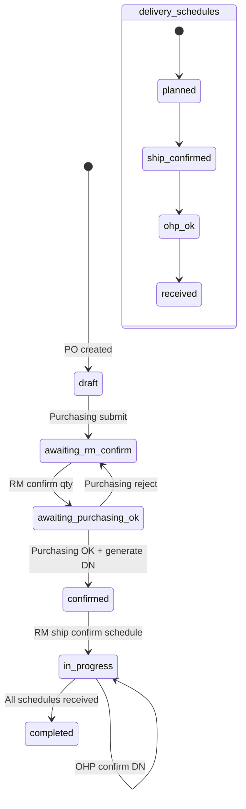

# Matex — Database Design

Portal **Material Exchange (Matex)** untuk traceability alur:
**PO (SDI) → Konfirmasi Supplier RM → DN → Kirim ke OHP → Konfirmasi OHP → Receiving PPIC → QAD → Billing RM**

Database: **MySQL** (`matex`), charset `utf8mb4`.

---

## 1. Conceptual Model (ER)

```mermaid
erDiagram
    companies ||--o{ users : "has"
    companies ||--o{ purchase_orders : "supplier_rm"
    companies ||--o{ purchase_orders : "ohp_supplier"
    users ||--o{ purchase_orders : "creates"
    items ||--o{ purchase_order_items : "ordered_as"
    purchase_orders ||--|{ purchase_order_items : "contains"
    purchase_orders ||--|{ delivery_schedules : "schedules"
    purchase_order_items ||--|{ delivery_schedules : "split_into"
    purchase_orders ||--o{ delivery_notes : "generates"
    delivery_schedules ||--|| delivery_notes : "one_dn"
    purchase_order_items ||--o{ delivery_notes : "on_dn"
    delivery_notes ||--o| ohp_confirmations : "confirmed_by_ohp"
    delivery_notes ||--o| receivings : "received_by_ppic"
    delivery_schedules ||--o| receivings : "closes"
    purchase_orders ||--o{ po_status_logs : "audit"
    users ||--o{ po_status_logs : "actor"
    users ||--o{ ohp_confirmations : "confirms"
    users ||--o{ receivings : "receives"

    companies {
        bigint id PK
        string code UK
        string name
        string type
        string address
        boolean is_active
    }

    users {
        bigint id PK
        string name
        string email UK
        string role
        bigint company_id FK
        string password
    }

    items {
        bigint id PK
        string item_number UK
        string description
        string uom
        boolean is_active
    }

    purchase_orders {
        bigint id PK
        string po_number UK
        bigint supplier_rm_id FK
        bigint ohp_supplier_id FK
        date due_date
        string status
        bigint created_by FK
    }

    purchase_order_items {
        bigint id PK
        bigint purchase_order_id FK
        bigint item_id FK
        decimal qty_ordered
        decimal qty_confirmed
    }

    delivery_schedules {
        bigint id PK
        bigint purchase_order_id FK
        bigint purchase_order_item_id FK
        date scheduled_date
        decimal qty
        decimal qty_confirmed
        string status
    }

    delivery_notes {
        bigint id PK
        string dn_number UK
        bigint purchase_order_id FK
        bigint delivery_schedule_id FK
        bigint purchase_order_item_id FK
        decimal qty
        timestamp generated_at
    }

    ohp_confirmations {
        bigint id PK
        bigint delivery_note_id FK UK
        bigint confirmed_by FK
        timestamp confirmed_at
        string sj_document_path
    }

    receivings {
        bigint id PK
        bigint delivery_note_id FK UK
        bigint delivery_schedule_id FK
        decimal received_qty
        bigint received_by FK
        string qad_status
        json qad_payload
        json qad_response
    }

    po_status_logs {
        bigint id PK
        bigint purchase_order_id FK
        string from_status
        string to_status
        bigint user_id FK
        string action
        text notes
        json meta
    }
```

---

## 2. Entity Groups

| Group | Tables | Purpose |
|-------|--------|---------|
| Master | `companies`, `users`, `items` | Stakeholder, akun, material |
| Transaction | `purchase_orders`, `purchase_order_items`, `delivery_schedules` | PO + qty + jadwal kirim |
| Logistics | `delivery_notes`, `ohp_confirmations` | DN print & konfirmasi OHP + SJ |
| Integration | `receivings` | Receiving PPIC + push QAD |
| Audit | `po_status_logs` | Traceability / timeline |

---

## 3. Table Dictionary

### 3.1 `companies`
Organisasi stakeholder.

| Column | Type | Notes |
|--------|------|-------|
| id | BIGINT PK | |
| code | VARCHAR UK | Mis. `SDI`, `RM01`, `OHP01` |
| name | VARCHAR | |
| type | VARCHAR | Enum: `sdi` \| `raw_mat` \| `ohp` |
| address | VARCHAR NULL | |
| is_active | BOOLEAN | Default true |
| timestamps | | |

### 3.2 `users`
Akun portal + role.

| Column | Type | Notes |
|--------|------|-------|
| id | BIGINT PK | |
| name | VARCHAR | |
| email | VARCHAR UK | |
| role | VARCHAR | `admin` \| `purchasing` \| `supplier_rm` \| `supplier_ohp` \| `ppic` |
| company_id | FK → companies NULL | Scoping data per perusahaan |
| password | VARCHAR | Hashed |
| email_verified_at | TIMESTAMP NULL | |
| remember_token | VARCHAR NULL | |
| timestamps | | |

**Role ↔ company type (aturan bisnis):**
- `purchasing`, `ppic`, `admin` → company `sdi`
- `supplier_rm` → company `raw_mat`
- `supplier_ohp` → company `ohp`

### 3.3 `items`
Master material.

| Column | Type | Notes |
|--------|------|-------|
| id | BIGINT PK | |
| item_number | VARCHAR UK | Sync-ready ke QAD |
| description | VARCHAR | |
| uom | VARCHAR | Default `kg` |
| is_active | BOOLEAN | |
| timestamps | | |

### 3.4 `purchase_orders`
Header PO dari Purchasing SDI ke Supplier RM; tujuan fisik = OHP.

| Column | Type | Notes |
|--------|------|-------|
| id | BIGINT PK | |
| po_number | VARCHAR UK | |
| supplier_rm_id | FK → companies | Pemasok raw material |
| ohp_supplier_id | FK → companies | Tujuan kirim (OH Part) |
| due_date | DATE | |
| status | VARCHAR | Lihat status machine |
| created_by | FK → users | |
| notes | TEXT NULL | |
| rejection_reason | TEXT NULL | Saat Purchasing reject konfirmasi RM |
| submitted_at | TIMESTAMP NULL | |
| rm_confirmed_at | TIMESTAMP NULL | |
| purchasing_approved_at | TIMESTAMP NULL | |
| timestamps | | |

**PO status:**
`draft` → `awaiting_rm_confirm` → `awaiting_purchasing_ok` → `confirmed` → `in_progress` → `completed`  
(reject Purchasing: kembali ke `awaiting_rm_confirm`)

### 3.5 `purchase_order_items`
Line item PO.

| Column | Type | Notes |
|--------|------|-------|
| id | BIGINT PK | |
| purchase_order_id | FK CASCADE | |
| item_id | FK → items | |
| qty_ordered | DECIMAL(12,3) | Qty dari Purchasing |
| qty_confirmed | DECIMAL(12,3) NULL | Revisi qty oleh Supplier RM |
| timestamps | | |
| UNIQUE | (purchase_order_id, item_id) | |

### 3.6 `delivery_schedules`
Jadwal kirim per line item (bisa >1 jadwal).

| Column | Type | Notes |
|--------|------|-------|
| id | BIGINT PK | |
| purchase_order_id | FK CASCADE | |
| purchase_order_item_id | FK CASCADE | |
| scheduled_date | DATE | |
| qty | DECIMAL(12,3) | Qty rencana |
| qty_confirmed | DECIMAL(12,3) NULL | Qty final dari RM |
| status | VARCHAR | `planned` → `ship_confirmed` → `ohp_ok` → `received` |
| ship_confirmed_at | TIMESTAMP NULL | |
| ship_confirmed_by | FK → users NULL | |
| timestamps | | |

**Constraint bisnis:** Σ `qty` jadwal per item ≤ `qty_ordered` (validasi di aplikasi).

### 3.7 `delivery_notes`
DN digenerate setelah Purchasing Confirm OK (1 schedule = 1 DN).

| Column | Type | Notes |
|--------|------|-------|
| id | BIGINT PK | |
| dn_number | VARCHAR UK | Mis. `DN-POTEST001-001` |
| purchase_order_id | FK CASCADE | |
| delivery_schedule_id | FK CASCADE | 1:1 praktis |
| purchase_order_item_id | FK CASCADE | Denormalisasi untuk query cepat |
| qty | DECIMAL(12,3) | Qty pada DN (pakai confirmed) |
| generated_at | TIMESTAMP | |
| timestamps | | |

### 3.8 `ohp_confirmations`
Konfirmasi barang OK di OHP + upload SJ berstempel.

| Column | Type | Notes |
|--------|------|-------|
| id | BIGINT PK | |
| delivery_note_id | FK UK CASCADE | 1 DN = 1 konfirmasi |
| confirmed_by | FK → users | |
| confirmed_at | TIMESTAMP | |
| sj_document_path | VARCHAR | Path di `storage/app/public/sj-documents` |
| notes | TEXT NULL | |
| timestamps | | |

### 3.9 `receivings`
Receiving PPIC + hasil push QAD.

| Column | Type | Notes |
|--------|------|-------|
| id | BIGINT PK | |
| delivery_note_id | FK UK CASCADE | 1 DN = 1 receiving |
| delivery_schedule_id | FK CASCADE | |
| received_qty | DECIMAL(12,3) | |
| received_by | FK → users | |
| received_at | TIMESTAMP | |
| qad_status | VARCHAR | `pending` \| `success` \| `failed` |
| qad_payload | JSON NULL | Request ke QAD |
| qad_response | JSON NULL | Response QAD / stub |
| notes | TEXT NULL | |
| timestamps | | |

Tabel ini juga menjadi **sumber penagihan Supplier RM**.

### 3.10 `po_status_logs`
Audit trail / timeline transparansi.

| Column | Type | Notes |
|--------|------|-------|
| id | BIGINT PK | |
| purchase_order_id | FK CASCADE | |
| from_status | VARCHAR NULL | |
| to_status | VARCHAR | |
| user_id | FK → users NULL | |
| action | VARCHAR | Mis. `submitted`, `rm_confirmed`, `received` |
| notes | TEXT NULL | |
| meta | JSON NULL | |
| timestamps | | |

---

## 4. Relationship Summary

| From | To | Cardinality | Keterangan |
|------|-----|-------------|------------|
| companies | users | 1:N | User milik satu company |
| companies | purchase_orders | 1:N (×2) | Sebagai RM **dan** sebagai OHP |
| purchase_orders | purchase_order_items | 1:N | Line items |
| purchase_order_items | delivery_schedules | 1:N | Split jadwal kirim |
| delivery_schedules | delivery_notes | 1:1 | Generate setelah approve |
| delivery_notes | ohp_confirmations | 1:0..1 | Setelah barang sampai OHP |
| delivery_notes | receivings | 1:0..1 | Setelah OHP OK |
| purchase_orders | po_status_logs | 1:N | History status |

---

## 5. Status Flow vs Tables



---

## 6. Index & Integrity Notes

- Unique: `companies.code`, `users.email`, `items.item_number`, `purchase_orders.po_number`, `delivery_notes.dn_number`
- Unique pair: `(purchase_order_id, item_id)` on `purchase_order_items`
- Unique FK: `ohp_confirmations.delivery_note_id`, `receivings.delivery_note_id`
- Cascade delete: children of PO (items, schedules, DNs, logs) ikut terhapus jika PO dihapus (opsional di produksi: soft-delete lebih aman)
- Qty memakai `DECIMAL(12,3)` untuk presisi kg

---

## 7. Data Flow (logical)

1. Purchasing buat `purchase_orders` + `purchase_order_items` + `delivery_schedules`
2. RM update `qty_confirmed` / `qty_confirmed` schedule
3. Purchasing approve → insert `delivery_notes`
4. RM update schedule → `ship_confirmed`
5. OHP insert `ohp_confirmations` (+ file SJ)
6. PPIC insert `receivings` + isi `qad_*`
7. Semua langkah penting dicatat di `po_status_logs`
8. RM billing membaca dari `receivings`

---

## 8. Out of Scope (fase berikutnya)

- Soft deletes / archive tables
- Pricing / invoice tables (billing saat ini view dari `receivings`)
- Master sync dari QAD (item/supplier pull)
- Multi-site / warehouse table
